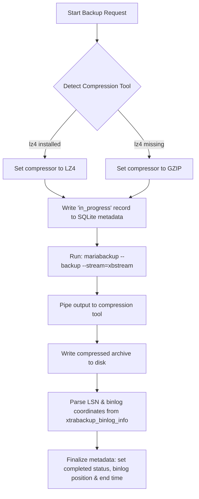

# 🤖 AI Developer & Agent Guide: mbkp

This guide is designed for **AI coding assistants** and **developers** working on the `mbkp` (MariaDB Backup & Recovery Tool) codebase. It provides immediate context on the codebase architecture, data schemas, core execution flows, local verification pipelines, and key guidelines for making modifications.

---

## 🗺️ Architectural Map

The repository is structured as a standard Go CLI utility:

*   **[cmd/mbkp/](cmd/mbkp)**: The CLI entry point and integration test suite.
    *   **[main.go](cmd/mbkp/main.go)**: Handles CLI flag parsing, commands (`backup`, `restore`, `pitr`, `list`), and maps them to functions in `internal/mbkp`.
    *   **[e2e_test.go](cmd/mbkp/e2e_test.go)**: Complete end-to-end integration tests using Podman to orchestrate isolated MariaDB source/recovery containers.
*   **[internal/mbkp/](internal/mbkp)**: Core package containing database utilities, physical backup/restore mechanics, binary log processing, and metadata catalog management.
    *   **[config.go](internal/mbkp/config.go)**: Defines the [`Config`](internal/mbkp/config.go#L15-L26) struct and environments/flags loading.
    *   **[backup.go](internal/mbkp/backup.go)**: Performs physical full ([`RunFullBackup`](internal/mbkp/backup.go#L221-L277)) and incremental ([`RunIncrementalBackup`](internal/mbkp/backup.go#L279-L358)) backups by streaming `mariabackup` output to compression pipelines.
    *   **[restore.go](internal/mbkp/restore.go)**: Implements backup lineage resolution, decompression, multi-stage preparation, and copy-back ([`RestoreBackup`](internal/mbkp/restore.go#L184-L252)).
    *   **[pitr.go](internal/mbkp/pitr.go)**: Manages Point-in-Time Recovery ([`RunPITR`](internal/mbkp/pitr.go#L54-L174)) by restoring the closest preceding physical backup and applying archived binlogs via `mariadb-binlog` and `mariadb`.
    *   **[binlog.go](internal/mbkp/binlog.go)**: Connection handling to flush active logs and archive closed binary logs on the local disk ([`BackupBinlogs`](internal/mbkp/binlog.go#L13-L107)).
    *   **[purge.go](internal/mbkp/purge.go)**: Implements dependency-aware expiration analysis, missing archive cleanup, and physical and metadata purging for full, incremental, and binlog backups ([`PurgeBackups`](internal/mbkp/purge.go#L74-L232)).
    *   **[metadata.go](internal/mbkp/metadata.go)**: Controls catalog persistence inside a local SQLite database (`backups.db`).
    *   **[list.go](internal/mbkp/list.go)**: Pretty-prints or exports backup metadata as JSON.

---

## ⚙️ Configuration & Database Schema

### 1. Configuration (`Config`)
The database connection arguments are mapped inside the `Config` struct. Connection details are loaded using **Viper** from both MariaDB-specific or MySQL-generic environment variables (without reading configuration files):
*   **Host**: `MARIADB_HOST` / `MYSQL_HOST` (default: `localhost`)
*   **Port**: `MARIADB_PORT` / `MYSQL_PORT` (default: `3306`)
*   **User**: `MARIADB_USER` / `MYSQL_USER` (default: `root`)
*   **Password**: Checked sequentially: `MARIADB_PASSWORD` ➡️ `MYSQL_PASSWORD` ➡️ `MYSQL_PWD` ➡️ `MARIADB_ROOT_PASSWORD` ➡️ `MYSQL_ROOT_PASSWORD`.
*   **Backup Directory**: Configured via the `--backup-dir` flag (bound through Cobra) or the `MBKP_BACKUP_DIR` environment variable.
*   **BackupBin**: Auto-detected at startup by `detectBackupTools()`. Prefers `mariadb-backup` (MariaDB 11.x), falls back to `mariabackup` (MariaDB 10.x), then `xtrabackup` (Percona/MySQL). Stored in `Config.BackupBin`.
*   **StreamBin**: The stream-extract binary paired with the backup tool — `mbstream` for MariaDB tooling, `xbstream` for Percona XtraBackup. Stored in `Config.StreamBin`.
*   **BinlogBin**: The binlog replay binary — `mariadb-binlog` (MariaDB) or `mysqlbinlog` (MySQL/Percona), detected individually. Stored in `Config.BinlogBin`.
*   **ClientBin**: The MySQL command-line client — `mariadb` (MariaDB) or `mysql` (MySQL/Percona), detected individually. Stored in `Config.ClientBin`.

### 2. SQLite Metadata Database (`backups.db`)
All metadata is tracked in an SQLite database `backups.db` created in the target `--backup-dir`. Database operations enable **WAL (Write-Ahead Logging)** mode for concurrency safety.

```sql
CREATE TABLE IF NOT EXISTS backups (
    id          TEXT PRIMARY KEY,
    type        TEXT NOT NULL,            -- 'full' or 'incremental'
    status      TEXT NOT NULL DEFAULT 'in_progress', -- 'in_progress', 'completed', 'failed'
    start_time  TEXT NOT NULL,            -- ISO8601 UTC
    end_time    TEXT,                     -- ISO8601 UTC (nullable)
    path        TEXT NOT NULL,            -- Relative path to the archive file
    binlog_file TEXT,                     -- Active binlog filename at backup end (nullable)
    binlog_pos  INTEGER NOT NULL DEFAULT 0, -- Binlog position at backup end
    parent_id   TEXT                      -- Root/parent backup ID (NULL for 'full')
);
```

### 3. Archive Layout & Compression
*   **Physical Backups**: Stored as streaming compressed archives (`.xbstream.<extension>`).
*   **Binary Logs**: Compressed individually during archiving (using `.lz4` or `.gz` extensions).
The system automatically detects and selects compression tools:
*   **LZ4**: Selection preference (fastest/lowest CPU). Extension: `.xbstream.lz4` or `.lz4`.
*   **GZIP**: Fallback option. Extension: `.xbstream.gz` or `.gz`.

---

## 🏗️ The Core Workflows

### 1. Backup Workflow

> [!NOTE]
> *   **Incremental Backups** utilize a shared LSN directory (`<backup-dir>/lsn`) which always holds the latest completed backup's checkpoints.
> *   `--incremental-basedir` points to this shared folder, and `--extra-lsndir` overwrites it upon successful backup runs.

### 2. Restore & Prepare Workflow
To restore an incremental backup, the system must rebuild the state step-by-step:
1.  **Resolve Chain**: Travel backwards from the target incremental ID via `parent_id` entries until the base `full` backup is found.
2.  **Extract Base**: Decompress and extract the base full backup archive into a temporary directory using `<decompressor> -dc | mbstream -x -C <prepareDir>`.
3.  **Prepare Base**: Run `mariabackup --prepare --target-dir=<prepareDir>` (for `xtrabackup`, include `--apply-log-only`).
4.  **Apply Incrementals**: For each incremental backup in chronological order:
    *   Extract archive to a temporary incremental folder.
    *   Run `mariabackup --prepare --target-dir=<prepareDir> --incremental-dir=<tempIncDir>` (for `xtrabackup`, include `--apply-log-only` on all intermediate steps, but omit it on the last incremental step).
5.  **Finalize**: Run `mariabackup --prepare --target-dir=<prepareDir>` a final time to roll back uncommitted transactions.
6.  **Copy-Back**: Verify target data directory is empty, then run `mariabackup --copy-back --target-dir=<prepareDir> --datadir=<datadir>`.

### 3. Point-in-Time Recovery (PITR)
Point-in-Time Recovery automates recovery to a precise timestamp:
1.  Query SQLite database for the closest completed backup (full or incremental) that finished **before** the target timestamp.
2.  Perform the full restore workflow of that base backup to the target `--datadir`.
3.  Automatically start a local temporary database daemon (`mariadbd` or `mysqld`) in the background, bound to `127.0.0.1` or socket-only, and poll for readiness (up to 2 minutes).
4.  Read `BinlogFile` and `BinlogPos` recorded for that restored backup.
5.  Scan the archived `binlogs/` directory to locate all binlog files starting from the base binlog.
6.  Decompress the identified compressed binlog files into a temporary directory.
7.  Execute `mariadb-binlog --start-position=<pos> --stop-datetime="<time>" <decompressed_binlogs...> | mariadb` to apply transactions.
8.  Stop the temporary database server cleanly by sending `SIGTERM` and waiting for exit.

### 4. Backup Purging & Retention Workflow
The `purge` command enforces the backup retention policy:
1.  **Parse & Cutoff**: Parse retention duration (e.g. `7d`, `30d`) and compute the cutoff timestamp `now - retention`.
2.  **External Cleanup**: Scan the metadata catalog. If any archive file is missing from disk, print a warning and delete its metadata record from SQLite.
3.  **Lineage Protection**: Identify completed backups within the retention window. Trace their restoration lineage chain. Mark all ancestors (parents/grandparents) to be kept so that the active backups remain restorable.
4.  **Clean Archives & Metadata**: Delete any backup archive files not marked to be kept from the disk and delete their SQLite metadata records.
5.  **Prune Binlogs**: Find the earliest binlog file required by the oldest kept backup. Delete archived binlog files from disk only if they are both expired (older than the cutoff time) and older than that earliest required binlog file.

---

## 🧪 Local Setup & Verification Runbook

### Makefile Targets
Run build and sanity checks locally:
```bash
make build   # Builds the 'mbkp' binary locally
make test    # Runs internal unit tests
make fmt     # Format Go source code files
make lint    # Run vet tests
make clean   # Cleans local binaries and logs
```

### Interactive Demo Script
A comprehensive demo script (`demo.sh`) is available to validate all functionality in an isolated environment:

```bash
./demo.sh
```

**Demo Workflow**:
1. **Container Setup**: Creates a Podman container running MariaDB 10.11 with binary logging enabled.
2. **Installation**: Builds and installs `mbkp` into the container.
3. **Test Data**: Creates database `d1` with table `t1` and inserts test records.
4. **Backup Operations**:
   - Full physical backups
   - Incremental backups (with dependency chains)
   - Binary log archiving
5. **Listing & Metadata**: Tests both table and JSON output formats.
6. **Purge Operations**: Validates retention policy enforcement and dependency-aware cleanup.
7. **Full Restore**: Validates restoration of full backups with data integrity checks.
8. **Incremental Restore**: Validates restoration of incremental backup chains.
9. **PITR**: Tests Point-in-Time Recovery to a specific timestamp.

**Prerequisites**:
- `podman` (container runtime)
- `pwgen` (password generation utility)

**Use Cases**:
- Pre-commit validation of code changes
- Verifying correct behavior after refactoring
- Demonstrating all features to stakeholders
- Debugging integration issues in a clean environment

### End-to-End Integration Tests
In addition to the demo script, Go-based integration tests are available:

```bash
cd cmd/mbkp
go test -v -run TestE2E
```

These tests use Podman/Docker to orchestrate isolated MariaDB containers and validate the complete backup/restore lifecycle.

---

## 💡 Critical Guidelines for AI Agents

> [!IMPORTANT]
> Keep the following constraints in mind when editing or creating code:
> *   **Documentation Integrity**: Do not remove any existing documentation, comments, or docstrings unless explicitly asked.
> *   **Documentation Sync**: Whenever you add, remove, or modify CLI commands, database schemas, configuration fields, or core workflows, you MUST update this `AGENTS.md` file to keep it fully accurate and in sync with the codebase.
> *   **Backward Compatibility**: Ensure that schema alterations to the SQLite table `backups` are backward compatible. Handle missing columns or fallback defaults carefully.
> *   **Empty Directory Check**: Before running `mariabackup --copy-back`, always check if the target data directory exists and is empty (excluding `.` and `..`). Do not write backups over existing operational databases.
> *   **Resource Leak Cleanup**: When extracting compressed archives for recovery (`RestoreBackup` or `RunPITR`), ensure all temporary extraction folders are properly cleaned up via `defer os.RemoveAll(...)` even when steps fail.
> *   **Pipeline Errors**: Always capture and check exit errors for all piped commands (e.g., both `mariabackup` and the compression utility `lz4`/`gzip`). Do not ignore intermediate pipe errors.
> *   **Pruning Dependencies**: Never purge parent backups that newer incremental backups depend on, even if those parents are outside the retention window.
> *   **Dry-run Mode Safety**: Always honor the `--dry-run` flag to preview modifications before performing any deletion on disk or SQLite metadata.
> *   **External Deletion Handling**: If archive files are missing from disk, log a warning and clean up their SQLite metadata rather than throwing a blocking error.
> *   **Binlog Retention**: Retain any archived binary logs that might be required by any of the kept physical backups (i.e. those with a filename lexicographically greater than or equal to the earliest kept backup's start binlog file), even if their age is outside the retention window.
> *   **Latest Binlog Exclusion**: When backing up binary logs, always exclude the latest active binary log file created after the log flush.
> *   **Temporary Binlog Cleanup**: Any temporary binlog decompression directories created during PITR execution must be defer-cleaned up.
> *   **Credentials Security**: Never pass the database password as a command line argument (e.g. `--password`) to external utilities or print it in application logs. Use the `MYSQL_PWD` environment variable to securely pass the password to child processes.
> *   **Backup Tool Detection**: Three mutually exclusive backup tools are supported: `mariadb-backup` (MariaDB 11.x), `mariabackup` (MariaDB 10.x), and `xtrabackup` (Percona/MySQL). `detectBackupTools()` (in `config.go`) resolves all four companion binaries (`BackupBin`, `StreamBin`, `BinlogBin`, `ClientBin`) at startup. Always use the `cfg.*Bin` fields; never hard-code a binary name. Percona XtraBackup uses `xbstream` (not `mbstream`) for extraction and `mysqlbinlog`/`mysql` for binlog replay.
