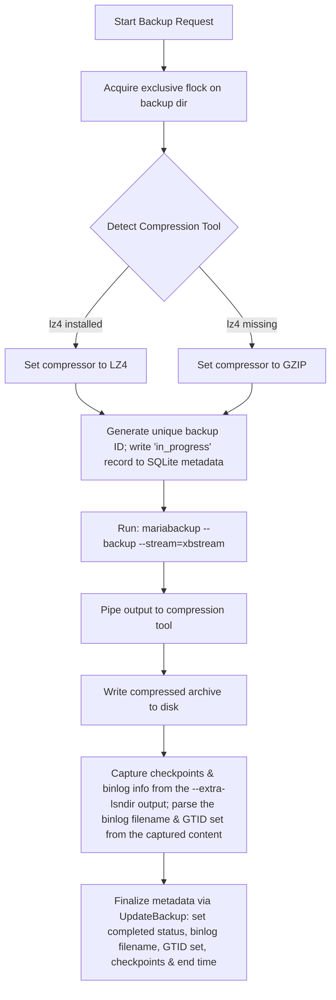

# 🤖 AI Developer & Agent Guide: mbkp

This guide is designed for **AI coding assistants** and **developers** working on the `mbkp` (MariaDB Backup & Recovery Tool) codebase. It provides immediate context on the codebase architecture, data schemas, core execution flows, local verification pipelines, and key guidelines for making modifications.

---

## 🗺️ Architectural Map

The repository is structured as a standard Go CLI utility:

*   **[cmd/mbkp/](cmd/mbkp)**: The CLI entry point and integration test suite.
    *   **[main.go](cmd/mbkp/main.go)**: Handles CLI flag parsing, commands (`backup`, `restore`, `pitr`, `list`), and maps them to functions in `internal/mbkp`.
    *   **[e2e_test.go](cmd/mbkp/e2e_test.go)**: Complete end-to-end integration tests using Podman to orchestrate isolated MariaDB source/recovery containers.
*   **[internal/mbkp/](internal/mbkp)**: Core package containing database utilities, physical backup/restore mechanics, binary log processing, and metadata catalog management.
    *   **[config.go](internal/mbkp/config.go)**: Defines the [`Config`](internal/mbkp/config.go#L15-L26) struct and environments/flags loading.
    *   **[backup.go](internal/mbkp/backup.go)**: Performs physical full ([`RunFullBackup`](internal/mbkp/backup.go)) and incremental ([`RunIncrementalBackup`](internal/mbkp/backup.go)) backups with context cancellation by streaming `mariabackup` output to compression pipelines.
    *   **[restore.go](internal/mbkp/restore.go)**: Implements backup lineage resolution, decompression, multi-stage preparation, and copy-back ([`RestoreBackup`](internal/mbkp/restore.go)).
    *   **[pitr.go](internal/mbkp/pitr.go)**: Manages Point-in-Time Recovery ([`RunPITR`](internal/mbkp/pitr.go)) by restoring the closest preceding physical backup and applying archived binlogs via `mariadb-binlog` and `mariadb`.
    *   **[binlog.go](internal/mbkp/binlog.go)**: Connection handling to flush active logs and archive closed binary logs on the local disk ([`BackupBinlogs`](internal/mbkp/binlog.go)).
    *   **[purge.go](internal/mbkp/purge.go)**: Implements dependency-aware expiration analysis, missing archive cleanup, and physical and metadata purging for full, incremental, and binlog backups ([`PurgeBackups`](internal/mbkp/purge.go)).
    *   **[metadata.go](internal/mbkp/metadata.go)**: Controls catalog persistence inside a local SQLite database (`backups.db`): `AddBackup` inserts rows strictly (a duplicate ID is a loud error, never a silent overwrite) and `UpdateBackup` performs the `in_progress` → `completed`/`failed` transition.
    *   **[lock.go](internal/mbkp/lock.go)**: Cross-process serialization via an exclusive non-blocking `flock` on `<backup-dir>/.mbkp.lock` ([`AcquireLock`](internal/mbkp/lock.go)), taken by every mutating command so two `mbkp` processes never mutate one backup directory concurrently.
    *   **[list.go](internal/mbkp/list.go)**: Pretty-prints or exports backup metadata as JSON ([`ListBackups`](internal/mbkp/list.go)).

---

## ⚙️ Configuration & Database Schema

### 1. Configuration (`Config`)
The database connection arguments are mapped inside the `Config` struct. Connection details are loaded using **Viper** from both MariaDB-specific or MySQL-generic environment variables (without reading configuration files):
*   **Host**: `MARIADB_HOST` / `MYSQL_HOST` (default: `localhost`)
*   **Port**: `MARIADB_PORT` / `MYSQL_PORT` (default: `3306`)
*   **User**: `MARIADB_USER` / `MYSQL_USER` (default: `root`)
*   **Password**: Checked sequentially: `MARIADB_PASSWORD` ➡️ `MYSQL_PASSWORD` ➡️ `MYSQL_PWD` ➡️ `MARIADB_ROOT_PASSWORD` ➡️ `MYSQL_ROOT_PASSWORD`.
*   **Backup Directory**: Configured via the `--backup-dir` flag (bound through Cobra) or the `MBKP_BACKUP_DIR` environment variable.
*   **BackupBin**: Auto-detected at startup by `detectBackupTools()`. Prefers `mariadb-backup` (MariaDB 11.x), falls back to `mariabackup` (MariaDB 10.x), then `xtrabackup` (Percona/MySQL). Stored in `Config.BackupBin`.
*   **StreamBin**: The stream-extract binary paired with the backup tool — `mbstream` for MariaDB tooling, `xbstream` for Percona XtraBackup. Stored in `Config.StreamBin`.
*   **BinlogBin**: The binlog replay binary — `mariadb-binlog` (MariaDB) or `mysqlbinlog` (MySQL/Percona), detected individually. Stored in `Config.BinlogBin`.
*   **ClientBin**: The MySQL command-line client — `mariadb` (MariaDB) or `mysql` (MySQL/Percona), detected individually. Stored in `Config.ClientBin`.

### 2. SQLite Metadata Database (`backups.db`)
All metadata is tracked in an SQLite database `backups.db` created in the target `--backup-dir`. Database operations enable **WAL (Write-Ahead Logging)** mode for concurrency safety.

```sql
CREATE TABLE IF NOT EXISTS backups (
    id          TEXT PRIMARY KEY,
    type        TEXT NOT NULL,            -- 'full' or 'incremental'
    status      TEXT NOT NULL DEFAULT 'in_progress', -- 'in_progress', 'completed', 'failed'
    start_time  TEXT NOT NULL,            -- ISO8601 UTC
    end_time    TEXT,                     -- ISO8601 UTC (nullable)
    path        TEXT NOT NULL,            -- Relative path to the archive file
    binlog_file TEXT,                     -- Binlog filename at backup end (nullable; retention anchor & PITR archive-completeness check)
    gtid        TEXT,                     -- GTID set at backup end (nullable; the PITR replay boundary)
    parent_id   TEXT,                     -- Root/parent backup ID (NULL for 'full')
    checkpoints TEXT                      -- Raw checkpoints file content (nullable)
);
```

### 3. Archive Layout & Compression
*   **Physical Backups**: Stored as streaming compressed archives (`.xbstream.<extension>`).
*   **Binary Logs**: Compressed individually during archiving (using `.lz4` or `.gz` extensions).
The system automatically detects and selects compression tools:
*   **LZ4**: Selection preference (fastest/lowest CPU). Extension: `.xbstream.lz4` or `.lz4`.
*   **GZIP**: Fallback option. Extension: `.xbstream.gz` or `.gz`.

---

## 🏗️ The Core Workflows

### 1. Backup Workflow

```mermaid
graph TD
    A[Start Backup Request] --> A2[Acquire exclusive flock on backup dir]
    A2 --> B{Detect Compression Tool}
    B -->|lz4 installed| C[Set compressor to LZ4]
    B -->|lz4 missing| D[Set compressor to GZIP]
    C & D --> E[Generate unique backup ID; write 'in_progress' record to SQLite metadata]
    E --> F[Run: mariabackup --backup --stream=xbstream]
    F --> G[Pipe output to compression tool]
    G --> H[Write compressed archive to disk]
    H --> I[Capture checkpoints & binlog info from the --extra-lsndir output; parse the binlog filename & GTID set from the captured content]
    I --> J[Finalize metadata via UpdateBackup: set completed status, binlog filename, GTID set, checkpoints & end time]
```
> [!NOTE]
> *   **Serialization**: Every mutating command (`backup full|incremental|binlog`, `restore`, `pitr`, `purge` — including `--dry-run`) takes an exclusive, non-blocking `flock` on `<backup-dir>/.mbkp.lock` for its whole run; a colliding invocation fails fast with the holder's PID instead of queueing. The lock is kernel-managed (released on process exit, so a killed run leaves no stale lock) and acquired only at the CLI entry points in `cmd/mbkp/main.go`. `list` runs lock-free (WAL readers are safe). Locks are per backup directory — independent directories never block each other.
> *   **Backup IDs** carry a millisecond suffix kept strictly monotonic within the process (`full_20260914_093000_482`, from `newBackupID`), so two runs of the same type starting within one second (small databases, scripted loops, immediate retries) never share an ID; combined with insert-only catalog writes, two runs can never silently merge their metadata rows.
> *   **Failure Transitions**: Any failure after the `in_progress` row is inserted — including context cancellation — transitions the row to `status: "failed"` (with `end_time`) via a best-effort `UpdateBackup`; if that update itself fails, the error is logged and the original failure is returned. Without this transition `purge` would retain the orphaned row for the whole retention window.
> *   **Incremental Backups** base on the *chosen parent's* checkpoints, which are stored per-backup in the SQLite catalog (`checkpoints` column, raw `xtrabackup_checkpoints`/`mariadb_backup_checkpoints` file content captured via `--extra-lsndir` into a per-run temp dir `<backup-dir>/lsn_tmp_<id>` that is removed afterwards).
> *   The binlog filename and GTID set are parsed from the same `--extra-lsndir` output (the `binlog_pos = filename '…', position '…', GTID of the last change '…'` line of `xtrabackup_info`/`mariadb_backup_info`) and stored in the `binlog_file`/`gtid` columns — the backup archive is never decompressed or extracted just to read the info files. A backup with an empty GTID set (server running without GTIDs) warns at backup time; PITR refuses such backups.
> *   `--incremental-basedir` points at a temp dir (`<backup-dir>/incbase_tmp_<id>`) materialized from the parent's stored checkpoints (written under both tool-specific filenames), so the delta always matches the recorded `parent_id` — never whatever backup happened to run last.
> *   An incremental fails fast if the parent is not `completed` or has no stored checkpoints; the remediation is to take a new full backup.

### 2. Restore & Prepare Workflow
To restore an incremental backup, the system must rebuild the state step-by-step:
1.  **Resolve Chain**: Travel backwards from the target incremental ID via `parent_id` entries until the base `full` backup is found (with cycle detection and backup ID validation guarding against corrupted catalogs).
2.  **Extract Base**: Decompress and extract the base full backup archive into a temporary directory using `<decompressor> -dc | mbstream -x -C <prepareDir>` (the `prepare_<backupID>` directory is cleaned up via defer if any prepare or extraction step fails).
3.  **Prepare Base**: Run `mariabackup --prepare --target-dir=<prepareDir>` (for `xtrabackup`, include `--apply-log-only`).
4.  **Apply Incrementals**: For each incremental backup in chronological order:
    *   Extract archive to a temporary incremental folder.
    *   Run `mariabackup --prepare --target-dir=<prepareDir> --incremental-dir=<tempIncDir>` (for `xtrabackup`, include `--apply-log-only` on all intermediate steps, but omit it on the last incremental step).
5.  **Finalize**: Run `mariabackup --prepare --target-dir=<prepareDir>` a final time to roll back uncommitted transactions.
6.  **Copy-Back**: Verify target data directory is empty (validated upfront before the expensive prepare to fail fast), then run `mariabackup --copy-back --target-dir=<prepareDir> --datadir=<datadir>`.
7.  **Server Identity (MySQL/Percona only)**: After copy-back, rebuild `<datadir>/auto.cnf` from the `server_uuid` line recorded in the prepared backup's `backup-my.cnf` (xtrabackup deliberately excludes `auto.cnf` from archives but records the UUID there — note it uses the underscore spelling `server_uuid`, while `auto.cnf` uses `server-uuid`). This keeps `gtid_executed` a single-UUID set across recovery generations instead of fragmenting it (`A:1-100,B:1-5,…`) with a fresh UUID per restore. MariaDB restores never touch `auto.cnf` (its GTIDs are `domain-server_id-seq` based). The `--new-server-uuid` flag (`restore` and `pitr` commands) opts out: no `auto.cnf` is written (and any stale one surviving copy-back is removed), so the server generates a fresh UUID on first start. A missing/malformed UUID in `backup-my.cnf` degrades to the old behavior with a warning; a failure to write `auto.cnf` fails the restore.

### 3. Point-in-Time Recovery (PITR)
Point-in-Time Recovery automates recovery to a precise timestamp. Replay is **GTID-based** — the recorded position-based mechanism was removed:
1.  Query SQLite database for the closest completed backup (full or incremental) that finished **before** the target timestamp.
2.  Fail fast (before restoring) if the base backup has no recorded GTID set (server ran without GTIDs, or capture failed at backup time).
3.  Perform the full restore workflow of that base backup to the target `--datadir` (including the `auto.cnf` server-identity step for MySQL/Percona, so the replay daemon — and any server started on the datadir afterwards — adopts the backed-up `server-uuid`; pass `--new-server-uuid` to `pitr` for a fresh identity).
4.  Automatically start a local temporary database daemon (`mariadbd` or `mysqld`) in the background, bound to `127.0.0.1` or socket-only, and poll for readiness (up to 2 minutes). A watcher goroutine owns `cmdDaemon.Wait()`: if the daemon process exits during the readiness poll (bad datadir permissions being the classic cause), the poll aborts immediately with the daemon's exit status and the `pitr_mariadbd.log` path instead of waiting out the full timeout. Each connect attempt is bounded (a 10s per-attempt context, plus 5s dial / 30s read DSN timeouts from `GetDSN`), so a hung network path cannot stall the loop. For MySQL-family servers the replay daemon is started with `--gtid-mode=ON --enforce-gtid-consistency=ON` (the replay stream carries `SET GTID_NEXT` statements).
5.  Read the `gtid` and `binlog_file` recorded for that restored backup.
6.  Scan the archived `binlogs/` directory to locate all binlog files starting from the base binlog (selection/efficiency + completeness check only — replay filtering itself is GTID-based).
7.  Decompress the identified compressed binlog files into a temporary directory.
8.  Execute one of the following pipelines to apply transactions:
    *   MariaDB: `mariadb-binlog --start-position=<gtid_set> --stop-datetime="<time>" <decompressed_binlogs...> | mariadb` — since MariaDB 10.8, `--start-position` accepts a GTID list treated as "the state the replica already knows" (exclusive).
    *   MySQL/Percona: `mysqlbinlog --exclude-gtids=<gtid_set> --stop-datetime="<time>" <decompressed_binlogs...> | mysql`.
9.  Stop the temporary database server cleanly by sending `SIGTERM` and waiting for exit; if it has not exited within 15 s, escalate to `SIGKILL` (the watcher goroutine reaps the process either way).

> [!NOTE]
> *   **GTID Prerequisite**: PITR requires GTID coordinates, which MariaDB servers always record; MySQL/Percona servers must run with `--gtid-mode=ON --enforce-gtid-consistency=ON` (backups taken without GTIDs warn at backup time and are refused by PITR). Standalone single-server topologies are assumed: in multi-domain setups (Galera, multi-source) the single recorded last-change GTID may not cover every domain.
> *   **Target Time Timezone**: `--target-time` accepts RFC3339 (with an explicit UTC offset) or a zoneless `YYYY-MM-DD HH:MM:SS` value interpreted in the host's **local** timezone. The `--stop-datetime` passed to the binlog tool is rendered in local time so the replay boundary is the same instant used to select the base backup.
> *   **Hard-Fail on Incomplete Replay**: PITR fails if the archived binlogs do not contain the base backup's start binlog file (the events between the backup's end and the next archived file would be unrecoverable), or if the binlog tool exits with an error — a partial replay never reports success.
> *   **Atomic Binlog Archiving**: Binary logs are compressed to a temporary `<name>.part` file and renamed into place, so a failed or killed run never leaves a truncated archive that later runs would skip as already archived.
> *   **Binlog Archive Deduplication**: `BackupBinlogs` skips a binlog if **any** compression variant of it (`.lz4` or `.gz`) is already archived — earlier runs may have used a different compressor — and `getBinlogFilesToApply` deduplicates by base name so a mixed-variant archive set is applied once, never twice (a duplicate would decompress into the same output path and be handed to the binlog tool a second time).

### 4. Backup Purging & Retention Workflow
The `purge` command enforces the backup retention policy:
1.  **Parse & Cutoff**: Parse retention duration (e.g. `7d`, `30d`; day multipliers are guarded against `time.Duration` integer overflow) and compute the cutoff timestamp `now - retention`.
2.  **Sweep Crash Leftovers**: Remove temporary directories (`lsn_tmp_*`, `target_tmp_*`, `incbase_tmp_*`, `prepare_*`, `pitr_binlogs_tmp`), temporary `mbkp-xtrabackup-*.cnf` option files, and partial `binlogs/*.part` archives older than 24 hours (`staleTempMaxAge`) — leftovers from killed runs whose in-process defers never executed. This runs before the catalog is opened, so reclamation does not depend on `backups.db` being readable, and it honors `--dry-run`. Removal failures are logged, never fatal.
3.  **External Cleanup**: Scan the metadata catalog. If any archive file is missing from disk, print a warning and delete its metadata record from SQLite.
4.  **Lineage Protection**: Identify completed backups within the retention window. Trace their restoration lineage chain. Mark all ancestors (parents/grandparents) to be kept so that the active backups remain restorable.
5.  **Clean Archives & Metadata**: Delete any backup archive files not marked to be kept from the disk and delete their SQLite metadata records.
6.  **Prune Binlogs**: Find the earliest binlog file required by the oldest kept backup. If the oldest kept backup has no recorded binlog file (unknown boundary), all archived binlogs are safely retained to prevent data loss. Otherwise, delete archived binlog files from disk only if they are both expired (older than the cutoff time) and older than that earliest required binlog file.

---

## 🧪 Local Setup & Verification Runbook

### Makefile Targets
Run build and sanity checks locally:
```bash
make build   # Builds the 'mbkp' binary locally
make test    # Runs internal unit tests
make fmt     # Format Go source code files
make lint    # Run vet tests
make clean   # Cleans local binaries and logs
```

### Interactive Demo Script
A comprehensive demo script (`demo.sh`) is available to validate all functionality in an isolated environment. Select the database flavor with `--mariadb` (default) or `--mysql`:

```bash
./demo.sh --mariadb   # MariaDB 10.11 (docker.io/library/mariadb:10.11)
./demo.sh --mysql     # Percona Server for MySQL 8.4 LTS (docker.io/percona/percona-server:8.4)
```

> [!NOTE]
> The `--mysql` flavor uses Percona Server 8.4 LTS rather than the newer 9.7 LTS because Percona XtraBackup 9.7 is not GA yet and `mbkp` requires `xtrabackup` for MySQL-family servers. At container creation it installs `percona-xtrabackup-84` (via `percona-release` + `microdnf`, plus a libev RPM from Rocky Linux 9 — the same steps as `installXtrabackup` in `cmd/mbkp/e2e_test.go` — and `perl-core` for the core perl modules xtrabackup's embedded scripts expect on the minimal UBI base) and starts the server with `--gtid-mode=ON --enforce-gtid-consistency=ON`, which is mandatory for GTID-based PITR. The `--mariadb` flavor keeps GTID-free MariaDB defaults. The `--mysql` flavor additionally requires network access inside the container to download the RPM packages.

**Demo Workflow**:
1. **Container Setup**: Creates a Podman container running MariaDB 10.11 (`--mariadb`) or Percona Server for MySQL 8.4 LTS (`--mysql`) with binary logging enabled (and GTID mode on for MySQL).
2. **Installation**: Builds and installs `mbkp` into the container.
3. **Test Data**: Creates database `d1` with table `t1` and inserts test records.
4. **Backup Operations**:
   - Full physical backups
   - Incremental backups (with dependency chains)
   - Binary log archiving
5. **Listing & Metadata**: Tests both table and JSON output formats.
6. **Purge Operations**: Validates retention policy enforcement and dependency-aware cleanup.
7. **Full Restore**: Validates restoration of full backups with data integrity checks (and, for `--mysql`, that the `server-uuid` is preserved).
8. **Incremental Restore**: Validates restoration of incremental backup chains (with the same `--mysql` uuid-preservation check).
9. **New-Server-UUID Restore**: Restores with `--new-server-uuid` and (for `--mysql`) asserts a fresh `server-uuid` is generated; for MariaDB the flag is exercised as a no-op.
10. **PITR**: Tests Point-in-Time Recovery to a specific timestamp (with the same `--mysql` uuid-preservation check).

**Prerequisites**:
- `podman` (container runtime)
- `pwgen` (password generation utility)

**Use Cases**:
- Pre-commit validation of code changes
- Verifying correct behavior after refactoring
- Demonstrating all features to stakeholders
- Debugging integration issues in a clean environment

### End-to-End Integration Tests
In addition to the demo script, Go-based integration tests are available:

```bash
cd cmd/mbkp
go test -v -run TestE2E
```

These tests use Podman/Docker to orchestrate isolated MariaDB containers and validate the complete backup/restore lifecycle.

---

## 💡 Critical Guidelines for AI Agents

> [!IMPORTANT]
> Keep the following constraints in mind when editing or creating code:
> *   **Documentation Integrity**: Do not remove any existing documentation, comments, or docstrings unless explicitly asked.
> *   **Documentation Sync**: Whenever you add, remove, or modify CLI commands, database schemas, configuration fields, or core workflows, you MUST update this `AGENTS.md` file to keep it fully accurate and in sync with the codebase.
> *   **Cross-Process Serialization**: Mutating commands must hold the exclusive `flock` on `<backup-dir>/.mbkp.lock` (`AcquireLock` in `internal/mbkp/lock.go`) for their entire run. Acquire it only at the CLI entry points in `cmd/mbkp/main.go`, never inside `internal/mbkp` functions — internal calls such as `RunPITR` → `RestoreBackup` run in one process and would self-deadlock on a second file description. The lock file is created once and never unlinked. `list` stays lock-free.
> *   **Strict Catalog Inserts**: `AddBackup` is insert-only — never reintroduce an upsert-by-ID: two runs sharing an ID must fail loudly (PRIMARY KEY violation), never silently merge rows. The `in_progress` → `completed`/`failed` transition goes through `UpdateBackup`, which only touches status/end_time/binlog_file/gtid/checkpoints.
> *   **Backward Compatibility**: Ensure that schema alterations to the SQLite table `backups` are backward compatible. Handle missing columns or fallback defaults carefully.
> *   **Empty Directory Check**: Before running `mariabackup --copy-back`, always check if the target data directory exists and is empty (excluding `.` and `..`). Do not write backups over existing operational databases. `RestoreBackup` validates this upfront to fail fast before the expensive prepare.
> *   **Resource Leak Cleanup**: When extracting compressed archives for recovery (`RestoreBackup` or `RunPITR`), ensure all temporary extraction folders and prepare directories (`prepare_<id>`) are properly cleaned up via `defer os.RemoveAll(...)` even when steps fail. When a pipeline command fails to start, any already-started child process is reaped with `cmd.Wait()` after `Process.Kill()` to prevent zombie processes.
> *   **Pipeline Errors**: Always capture and check exit errors for all piped commands (e.g., both `mariabackup` and the compression utility `lz4`/`gzip`). Do not ignore intermediate pipe errors.
> *   **Backup ID Validation & Cycle Guard**: All backup IDs and parent IDs are validated against `^[A-Za-z0-9_-]+$` before filesystem path construction or database operations to prevent path injection. Lineage chain resolution in `ResolveChain` and `resolveChainInMemory` includes cycle detection to guard against corrupted catalogs.
> *   **Catalog Path Validation**: The `path` column read back from the catalog is never trusted for filesystem operations: `validateCatalogPath` (in `metadata.go`) rejects rows whose path resolves outside the backup directory (empty, `.`, `..`, or containing `..` segments; absolute paths are neutralized by `filepath.Join`). `PrepareChain` fails loudly on such rows before any extraction; `purge` refuses to touch them (neither the archive nor the metadata row is deleted — the row is retained with a loud error); `list` shows no size. The catalog row queries also check `rows.Err()` so a mid-iteration DB failure is never misreported as "not found".
> *   **Pruning Dependencies**: Never purge parent backups that newer incremental backups depend on, even if those parents are outside the retention window.
> *   **Dry-run Mode Safety**: Always honor the `--dry-run` flag to preview modifications before performing any deletion on disk or SQLite metadata.
> *   **External Deletion Handling**: If archive files are missing from disk, log a warning and clean up their SQLite metadata rather than throwing a blocking error.
> *   **Binlog Retention**: Retain any archived binary logs that might be required by any of the kept physical backups (i.e. those with a filename lexicographically greater than or equal to the earliest kept backup's start binlog file), even if their age is outside the retention window. If the oldest kept backup has no recorded binlog file (e.g. capture failed at backup time), safely retain all archived binlogs.
> *   **Latest Binlog Exclusion**: When backing up binary logs, always exclude the latest active binary log file created after the log flush.
> *   **Temporary Binlog Cleanup**: Any temporary binlog decompression directories created during PITR execution must be defer-cleaned up.
> *   **Credentials Security**: Never pass the database password as a command line argument (e.g. `--password`) to external utilities or print it in application logs. The `MYSQL_PWD` environment variable is the credential channel for mariabackup/mariadb-backup and all client tools. Percona `xtrabackup` **ignores `MYSQL_PWD`** (verified by E2E: it reports "password: not set" and fails with access denied), so for it — and only it — the password is written to a temporary `0600` `[client]` option file inside the backup directory (removed when the run exits; a SIGKILL leftover is reclaimed by `purge`'s stale-temp sweep after 24 hours). Passwords containing `"`, `\`, or line breaks cannot be represented safely in option-file syntax and fail fast with a clear error before any file is created, instead of corrupting the quoting or injecting `[client]` directives (`#` is safe inside a quoted value).
> *   **Server-UUID Restoration Safety**: The restored `server-uuid` reuses the backup's identity on purpose; never run such a server concurrently with the original (or another clone of the same backup) in a replication topology — duplicate UUIDs make replication fail fatally and divergent GTID histories get silently skipped by replicas. Document `--new-server-uuid` as the escape hatch for clone scenarios. The MariaDB path must never write `auto.cnf`.
> *   **Backup Tool Detection**: Three mutually exclusive backup tools are supported: `mariadb-backup` (MariaDB 11.x), `mariabackup` (MariaDB 10.x), and `xtrabackup` (Percona/MySQL). `detectBackupTools()` (in `config.go`) resolves all four companion binaries (`BackupBin`, `StreamBin`, `BinlogBin`, `ClientBin`) at startup. Always use the `cfg.*Bin` fields; never hard-code a binary name. Percona XtraBackup uses `xbstream` (not `mbstream`) for extraction and `mysqlbinlog`/`mysql` for binlog replay.
> *   **TLS Registration & Connection Timeouts**: `mysql.RegisterTLSConfig` is called at most **once per unique TLS material** per process (`registerMySQLTLSConfig` in `config.go`), under a SHA-256-fingerprint-derived name (`mbkp-tls-<hash>`) — never once per connection (the PITR readiness loop can call `ConnectDB` repeatedly while polling for up to 2 minutes). Registrations are process-lifetime and deliberately never deregistered; distinct material gets a distinct name, so the registry can never go stale. `GetDSN` also pins bounded network timeouts (5 s dial / 30 s read) so a hung network path fails instead of stalling `ConnectDB` indefinitely.
> *   **Context Propagation & Signal Handling**: All operations in `internal/mbkp` (`RunFullBackup`, `RunIncrementalBackup`, `RestoreBackup`, `PrepareChain`, `RunPITR`, `BackupBinlogs`, `PurgeBackups`, `ListBackups`, and `ConnectDB`) take `ctx context.Context` as their first parameter. Subprocesses must be executed via `exec.CommandContext(ctx, ...)` so cancellation terminates them promptly. `cmd/mbkp/main.go` implements two-stage signal handling (`signal.Notify` on `os.Interrupt`/`syscall.SIGTERM`: the first signal initiates graceful shutdown and is recorded so the process exits with the conventional 128+N status — 130 for SIGINT, 143 for SIGTERM; a second signal restores default OS handling and terminates immediately), and commands use `RunE` so `defer release()` executes to release the `.mbkp.lock`. On cancellation, in-flight backups must transition to `status: "failed"` in SQLite, temporary directories (`lsn_tmp_*`, `prepare_*`, `pitr_binlogs_tmp`) and `.part` files must be cleaned up via `defer`, and the PITR recovery daemon must be cleanly terminated via `SIGTERM`.
